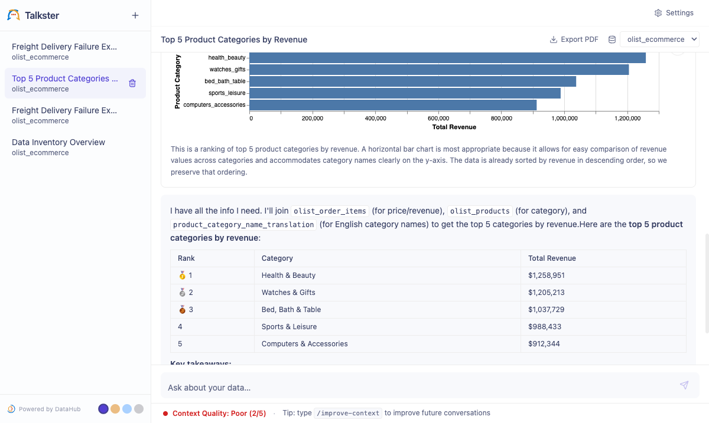
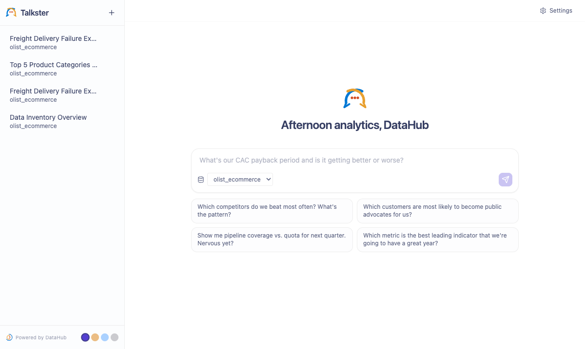

<p align="center">
  <picture>
    <source media="(prefers-color-scheme: dark)" srcset="frontend/public/analytics-agent-logo-dark-bg.svg">
    <source media="(prefers-color-scheme: light)" srcset="frontend/public/analytics-agent-logo-color.svg">
    
  </picture>
</p>

<p align="center">
  <strong>Natural-language data queries, powered by DataHub + LangGraph</strong><br>
  Ask a question. Get SQL, results, and a chart — in one turn.
</p>

<p align="center">
  
  
  
  
  
</p>

---

## ⚡ Quickstart

> **Requires:** Docker, DataHub CLI (`pip install acryl-datahub`), `uv`, Python 3.11+

```bash
git clone https://github.com/datahub-project/analytics-agent.git
cd analytics-agent
bash quickstart.sh
```

No `.env` editing required. The script:
- Starts a local DataHub instance (or connects to an existing one)
- Loads the Olist e-commerce sample dataset + catalog metadata
- Builds and launches Analytics Agent at **http://localhost:8000**

Open the browser — a setup wizard walks you through naming your agent, picking a model (Anthropic, OpenAI, or Google), and entering your API key. If you already have one of those keys exported in your shell, it's picked up automatically.

---

## What it looks like

<p align="center">
  
</p>

<p align="center">
  
</p>

---

## What it does

| | |
|---|---|
| **Plain-English → SQL → Chart** | Ask "top 5 categories by revenue" — the agent searches DataHub docs first, writes SQL, runs it, and auto-renders a Vega-Lite chart. |
| **Context Quality** | A live status bar shows how well your DataHub catalog supported the agent (1–5). Hover for the LLM's reasoning. Improves as you document your data. |
| **`/improve-context`** | Type `/improve-context` after any conversation to get a numbered list of documentation improvements the agent wishes it had — then approve and publish them to DataHub in one click. |
| **Multi-turn memory** | Follow-ups like "make it a pie chart" or "filter to Q3" work across turns. |
| **Collapsible reasoning** | Tool calls and agent thinking are shown but collapsed — visible when you want them, out of the way when you don't. |
| **4 themes** | DataHub (light/purple), Warm (light/orange), Ocean (dark/blue), Carbon (dark/gray). Switcher in the bottom-left. |
| **Multiple connections** | Add and manage multiple Snowflake, DuckDB, or SQLAlchemy connections from Settings. Each has its own encrypted credentials. |

---

## Manual setup (without quickstart.sh)

### 1. Clone and install

```bash
git clone https://github.com/datahub-project/analytics-agent.git
cd analytics-agent
just install   # uv sync + pnpm install
just start     # builds frontend, starts backend at :8000
```

Open **http://localhost:8000** — a setup wizard handles the LLM key and connections on first run.

> **Without `just`:** `uv sync && cd frontend && pnpm install && pnpm build && cd .. && uv run uvicorn analytics_agent.main:app --port 8000`

### Optional: pre-configure via `.env`

```bash
cp .env.example .env   # then edit as needed
```

```bash
# LLM — pick one provider (or leave blank and use the wizard)
LLM_PROVIDER=anthropic
ANTHROPIC_API_KEY=sk-ant-...

# DataHub (optional — can also be added via Settings → Connections)
DATAHUB_GMS_URL=https://your-instance.acryl.io/gms
DATAHUB_GMS_TOKEN=eyJhbGci...
```

### Useful just tasks

| Command | What it does |
|---|---|
| `just start` | Build frontend if stale, start backend |
| `just start-remote` | Start + show DataHub connection status |
| `just nuke` | Wipe the DB and start from scratch |
| `just dev` | Hot-reload backend (use `just dev-full` for frontend HMR too) |
| `just logs` | Tail backend logs |

### Development mode (hot reload)

```bash
# Terminal 1 — backend
uv run uvicorn analytics_agent.main:app --reload --port 8000

# Terminal 2 — frontend HMR (http://localhost:5173)
cd frontend && pnpm dev
```

---

## Connect DataHub

```bash
# DataHub Cloud (Acryl)
datahub init --sso --host https://your-instance.acryl.io/gms --token-duration ONE_MONTH

# Self-hosted
datahub init --host http://localhost:8080 --username datahub --password datahub

# Verify the connection
curl -s -X POST http://localhost:8000/api/settings/connections/datahub/test
```

---

## Connect Snowflake

### Option A — Service account via `config.yaml` (recommended)

```yaml
# config.yaml
engines:
  - type: snowflake
    name: snowflake
    connection:
      account: "${SNOWFLAKE_ACCOUNT}"
      warehouse: "${SNOWFLAKE_WAREHOUSE}"
      database: "${SNOWFLAKE_DATABASE}"
      schema: "${SNOWFLAKE_SCHEMA}"
      user: "${SNOWFLAKE_USER}"
```

### Option B — Key-pair auth

Generate an RSA key pair, upload the public key to Snowflake, then set `SNOWFLAKE_PRIVATE_KEY` (base64-encoded PEM) in `.env`.

### Option C — Personal SSO (Settings UI)

**Settings → Connections → Authentication → SSO** — opens a browser window for your IdP.

---

## LLM model routing

Four independently configurable model tiers:

| Task | Env var | Default (Anthropic) |
|---|---|---|
| Main analysis agent | `LLM_MODEL` | `claude-sonnet-4-6` |
| Chart generation | `CHART_LLM_MODEL` | `claude-haiku-4-5-20251001` |
| Context quality scoring | `QUALITY_LLM_MODEL` | `claude-haiku-4-5-20251001` |
| Titles & greeting | `DELIGHT_LLM_MODEL` | `claude-haiku-4-5-20251001` |

```bash
LLM_PROVIDER=anthropic
LLM_MODEL=claude-opus-4-7          # upgrade just the agent
QUALITY_LLM_MODEL=claude-sonnet-4-6 # or use a stronger model for quality scoring
```

---

## Database

The quickstart uses the DataHub MySQL container. For non-quickstart runs, SQLite is the default (`./data/dev.db`). Set `DATABASE_URL` in `.env` to switch backends — see `.env.example` for Postgres and SQLite formats.

---

## Settings UI

**Settings** (top-right) manages:
- **Connections** — test, edit, add, and delete engine connections
- **Authentication** — per-connection: Password, Private Key, SSO, PAT, OAuth
- **Tool toggles** — enable/disable individual DataHub or engine tools
- **Write-back skills** — `publish_analysis` and `save_correction` (enabled by default)
- **Prompt** — customize the system prompt
- **Display** — app name and logo

---

## Production

### Docker

```bash
docker build -f docker/Dockerfile -t analytics-agent .
docker run -p 8000:8000 --env-file .env analytics-agent
```

### Single process (no Docker)

```bash
cd frontend && pnpm build && cd ..
uv run uvicorn analytics_agent.main:app --host 0.0.0.0 --port 8000
```

---

## Architecture

```
analytics-agent/
├── backend/src/analytics_agent/
│   ├── agent/          # LangGraph ReAct graph, streaming, chart generation, analysis
│   ├── api/            # FastAPI routes: conversations, chat (SSE), settings, oauth
│   ├── context/        # DataHub tool loader (datahub_agent_context)
│   ├── db/             # SQLAlchemy models + Alembic migrations
│   │   └── models.py   # Conversation, Message, Integration, Setting
│   ├── engines/        # Pluggable query engines (Snowflake, DuckDB, SQLAlchemy)
│   ├── prompts/        # System prompt (system_prompt.md) + chart prompt
│   └── skills/         # Write-back skills: publish-analysis, save-correction,
│                       #   improve-context (/improve-context slash command)
└── frontend/src/
    ├── components/Chat/ # MessageList, MessageInput, ContextStatusBar
    ├── components/Settings/
    ├── api/             # fetch wrappers for REST + SSE stream reader
    └── store/           # Zustand: conversations, display, theme
```

**SSE event flow:**
```
User message → POST /api/conversations/{id}/messages
  → resolver.py resolves credentials → configured engine
  → LangGraph ReAct agent (DataHub tools + engine tools)
  → astream_events → TEXT / TOOL_CALL / TOOL_RESULT / SQL / CHART / COMPLETE
  → Frontend renders each event type inline
  → Background: context quality scored async, stored on conversation row
```

---

<p align="center">
  <a href="https://datahub.com">
    
  </a>
  <br>
  <sub>Built with <a href="https://datahub.com">DataHub</a> · <a href="https://langchain.com/langgraph">LangGraph</a> · <a href="https://fastapi.tiangolo.com">FastAPI</a> · <a href="https://react.dev">React</a></sub>
</p>
